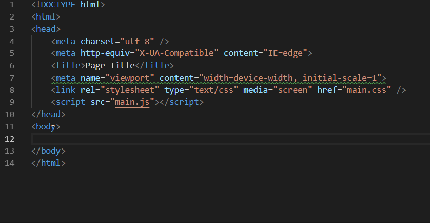

# Web Accessibility Extension - Visual Studio Code

[](http://opensource.org/licenses/MIT)
[](https://github.com/mvdschee/web-accessibility/releases)
[](https://marketplace.visualstudio.com/items?itemName=MaxvanderSchee.web-accessibility)

### So I heard you wanted to write more accessible code? Well, you came to the right Extension!

> This extension is here to help you get feedback on what parts need some more attention for it to be accessible, this is just the basics and doesn't cover all the rules but will help with making your project more accessible.

## ✨Features



The extension can do the following for you:

- Highlight elements that you should consider changing.
- Give a hint on how you should change it.

## 🔒Extension Settings

The settings can be found at `File > Preferences > Settings > Extensions > Web Accessibility`

| Settings               | Type    | Default |
| ---------------------- | ------- | ------- |
| Max Number Of Problems | number  | 100     |
| Semantic HTML          | boolean | false   |
| Trace: Server          | string  | off     |

## 📝Release Notes

All notable changes to this project will be documented in the [Changelog](./CHANGELOG.md).

## Develop

1. type in the terminal:

   ```bash
   # install dependencies
   $ npm install
   ```

2. Open debug panel in VScode and `RUN` "Launch Client"

3. Open a project which contains a `HTML` file and see the linting in action.

## 💚License

Do what you want with the code it's MIT Licensed!

## 😄Misc

Follow Me: [Medium](https://medium.com/@maxvanderschee), [GitHub](https://github.com/mvdschee), [Twitter](https://twitter.com/maxvanderschee)

[© Max van der Schee 2018](https://maxvanderschee.nl)
